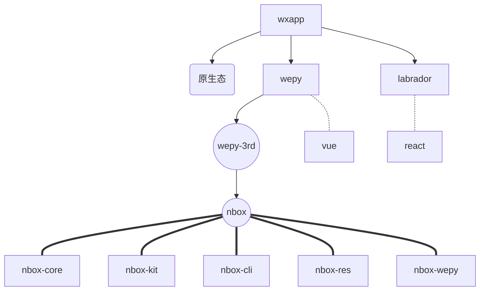
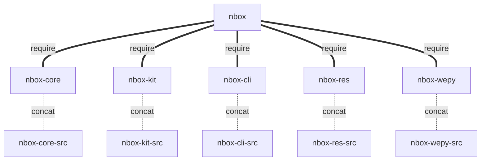
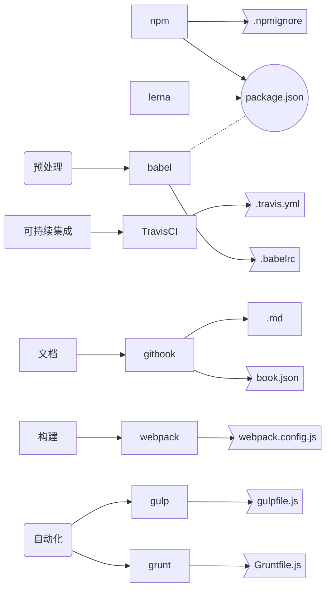

# nbox
npm and js utils box

[TOC]

# nbox.js

[](https://travis-ci.org/bbxyard/nbox)   [](https://www.npmjs.org/package/nbox)   [](https://npmcharts.com/compare/nbox?minimal=true)


## 简介
### 心路历程
- C++ 服务器开发 太久、太土、代码量大、异步处理复杂
- 目标全栈工程师 + 攘外必先安内-OA办工自动化
- 终端应用从小程序抓起
- 接触 Javascript 事件驱动+异步IO 深得我心
- 接触ES6、特别ES7 async await 优雅写法 相见恨晚
- 神一般的前端体系，各种工序，工具链不少
- 积累公共库，熟悉各工具流
- 防止健忘 + 保存学习代码




### 实现细节


### 已接触工具链


## 资源获取
### 源码方式
- https://github.com/bbxyard/nbox

### NPM方式
```bash
# 完整包
npm install nbox --save

# 核心包(部分代码)
npm install nbox-core --save

# wepy调用相关封装包(框架)
npm install nbox-wepy --save

# res资源包(词典性质: 如省市地名等)
npm install nbox-res --save

# kit工具包(工具性封装，加个命令行，可以衍生不少工具)
npm install nbox-kit --save

# cli命令行工具集(一个自枚举框架)非常易于扩展
npm install nbox-cli -g
```

## 项目初衷
 - [x] 前后端、各项目间公用代码
 - [x] 存放学习代码 如: nbox-core/test/{_in, _3rd}

## 已知问题
 - 刚刚起步，框架为先，代码不多，不断完善中

## sub projects
- [**nbox**](packages/nbox/README.md)
- [**nbox-cli**](packages/nbox-cli/README.md)
- [**nbox-core**](packages/nbox-core/README.md)
- [**nbox-kit**](packages/nbox-kit/README.md)
- [**nbox-res**](packages/nbox-res/README.md)
- [**nbox-wepy**](packages/nbox-wepy/README.md)


---
## 参考
### 参考文档
 - [阮一峰 - 持续集成服务 Travis CI 教程](http://www.ruanyifeng.com/blog/2017/12/travis_ci_tutorial.html)
 - [lerna入门篇](https://www.jianshu.com/p/63ec67445b0f)

### 实用工具
 - [Markdown绘图-Mermaid](https://mermaidjs.github.io)
 - [Markdown绘图-Mermaid Live Editor](https://mermaidjs.github.io/mermaid-live-editor)
 - [Markdown绘图-Mermaid-Haroopad](http://pad.haroopress.com/user.html)
 - [可持续集成-Travis CI](https://travis-ci.org)
