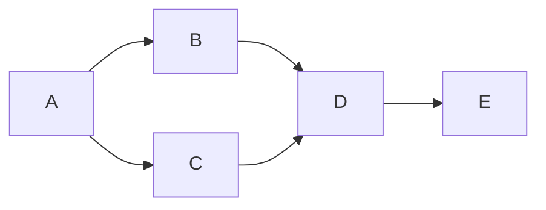
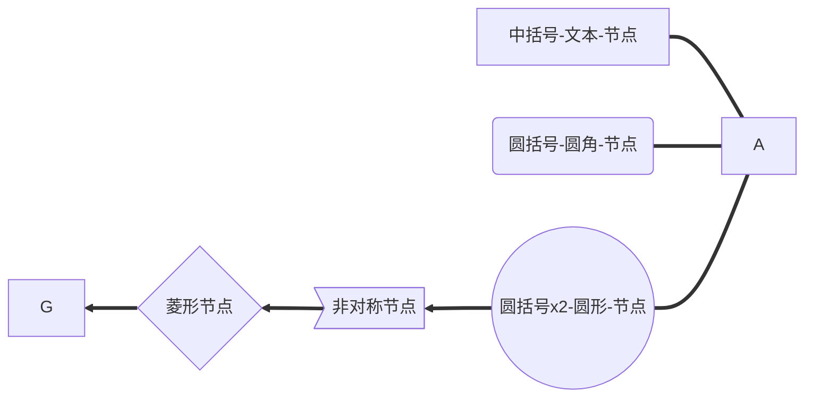
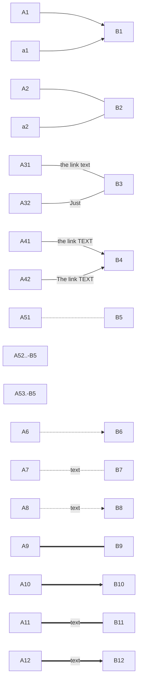
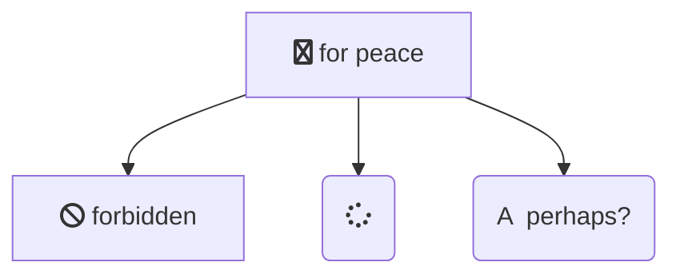
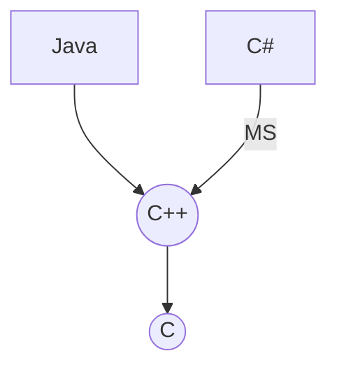
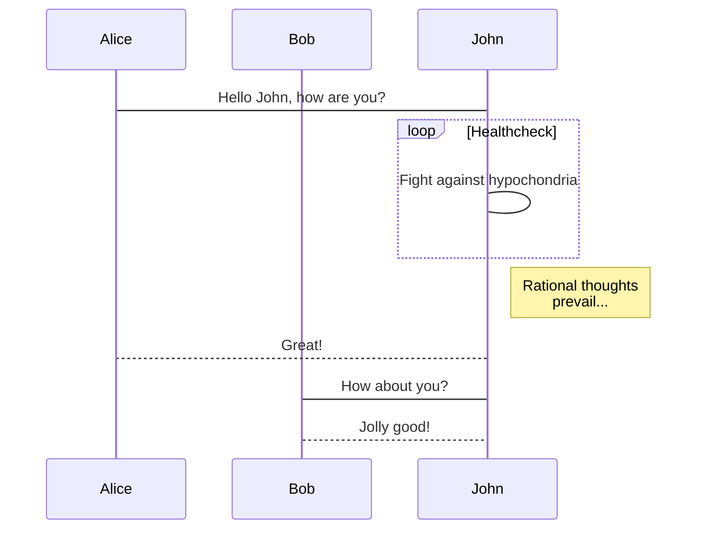
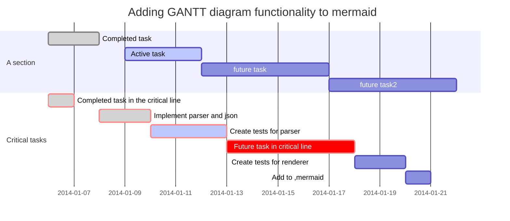

[TOC]

---
## Mermaind

## 流程图
### basic



### 节点

- 默认节点 A
- 文本节点 B[bname]
- 圆角节点 C(cname)
- 圆形节点 D((dname))
- 非对称节点 E>ename]
- 菱形节点 F{fname}



### 连线

- 箭头连接 A1–>B1
- 开放连接 A2—B2
- 标签连接 A3–text—B3 或者 A3—|text|B3
- 箭头标签连接 A4–text –>B4 或者 A4–>|text|B4
- 虚线开放连接 A5.-B5 或者 A5-.-B5 或者 A5..-B5
- 虚线箭头连接 A6.->B6 或者 A6-.->B6
- 标签虚线连接 A7-.text.-B7
- 标签虚线箭头连接 A8-.text.->B8
- 粗线开放连接 A9===B9
- 粗线箭头连接 A10==>B10
- 标签粗线开放连接 A11==text===B11
- 标签粗线箭头连接 A12==text==>B12



```mermaid
graph TB
  subgraph one
  a1 --> a2
  en
  subgraph two
  b2 --> b2
  end
  subgraph three
  c1 --> c2
  end
  c1 --> a2
```

**高级**


**样例**


---

## 时序图



## 甘特图(gantt diagram)
